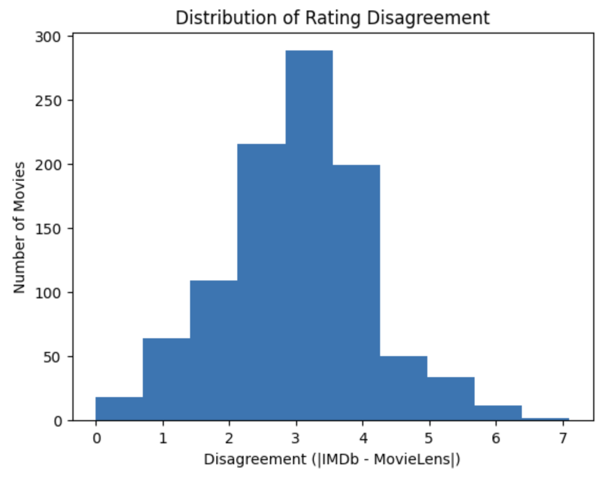
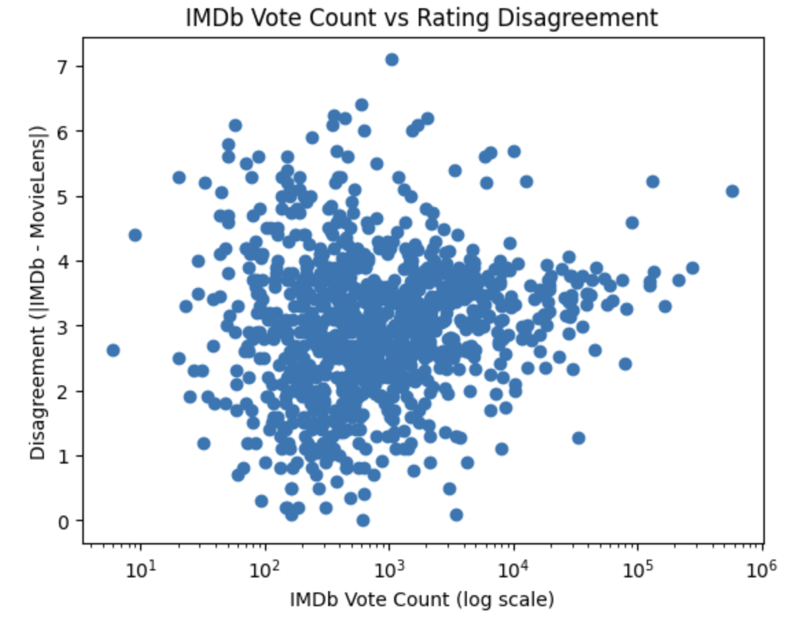
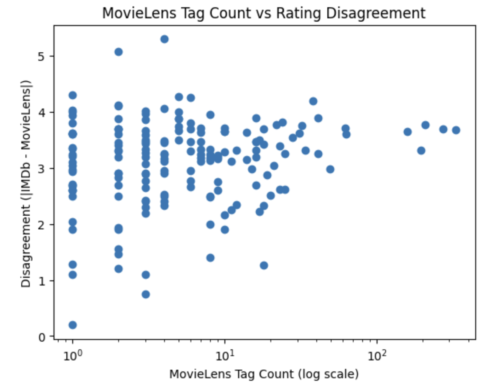

# Movie Rating Analysis

A cross-platform movie rating analysis project comparing IMDb and MovieLens ratings for movies released between 2020 and 2025.

This project was developed as part of a university database and analytics project at the University of British Columbia.

---

## Project Overview

The goal of this project is to investigate:

- How consistent movie ratings are between IMDb and MovieLens
- Whether user engagement is associated with rating disagreement across platforms

The analysis combines structured SQL workflows, MongoDB document modeling, Python data preprocessing, and exploratory data analysis.

---

## Research Questions

1. How consistent are IMDb and MovieLens ratings for the same movies?

2. Is user engagement associated with rating disagreement between platforms?

User engagement was measured using:

- IMDb vote counts
- MovieLens tag counts

---

## Technologies Used

- Python
- Pandas
- SQL
- MongoDB
- Jupyter Notebook
- Matplotlib

---

## Database Design

### Oracle SQL Implementation

The relational implementation used normalized tables for:

- Movies
- IMDb metadata
- MovieLens ratings
- MovieLens tags
- TMDB metadata

Data was linked through movie identifiers and IMDb IDs.

### MongoDB Implementation

The MongoDB implementation used a movie-centered document model where each document stored:

- IMDb ratings
- MovieLens ratings
- Tag counts
- TMDB metadata
- Derived disagreement metrics

This structure reduced query complexity and simplified movie-level analysis.

---

## Data Processing Pipeline

The project integrates data from:

- IMDb
- MovieLens
- TMDB

Processing steps included:

- Filtering movies released between 2020–2025
- Cleaning invalid identifiers
- Matching cross-platform movie records
- Aggregating MovieLens ratings
- Computing alignment and disagreement metrics

Due to database storage constraints, a subset of approximately 1000 movies was used for final analysis.

---

## Repository Structure

```text
data/subset/      -> subset datasets used for analysis
images/           -> visualizations and ER diagram
notebooks/        -> Jupyter notebooks
scripts/          -> helper scripts
sql/              -> SQL table creation scripts
```

---

## Sample Visualizations

### Distribution of Rating Disagreement



### IMDb Vote Count vs Rating Disagreement



### MovieLens Tag Count vs Rating Disagreement



---

## Key Findings

- IMDb and MovieLens ratings were generally aligned but showed moderate disagreement across many movies
- Most disagreement values were concentrated between 2 and 4
- User engagement did not show a strong relationship with disagreement magnitude
- MongoDB simplified movie-centered analytical workflows compared to relational joins in SQL

---

## Contributors

This project was completed as part of a group project for CPSC 368: Databases in Data Science at the University of British Columbia.

Contributors:

- Tim Zeng
- Jiahao Li
- Manya Jain
